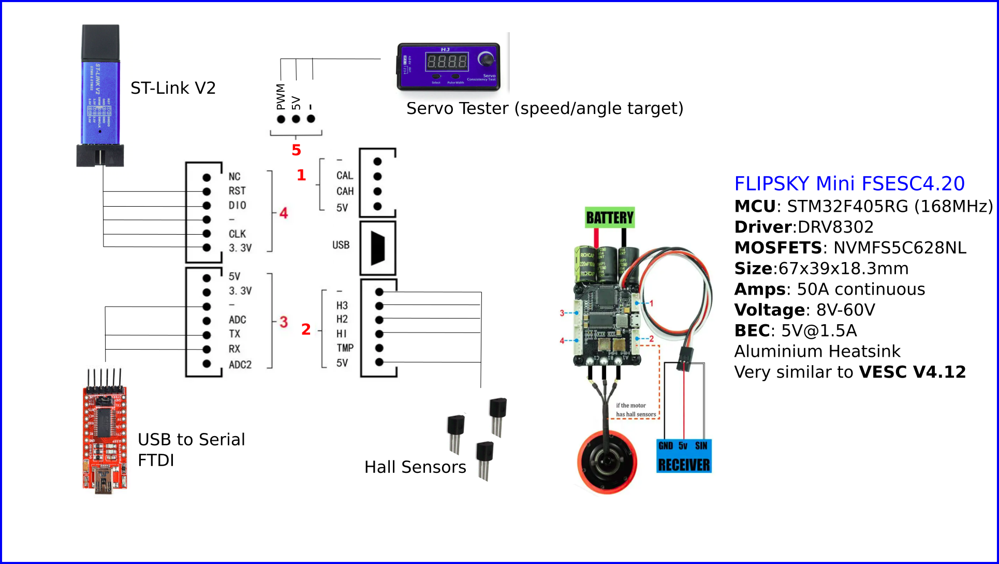
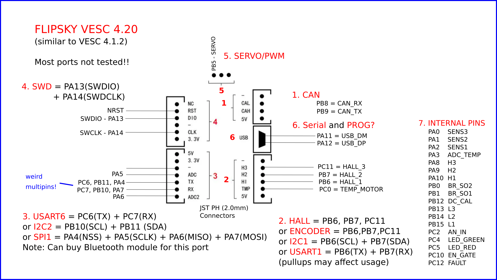

## VESC on Arduino - 1kW of Brushless Power

This is the code that goes alongside this youtube video:
https://youtu.be/B5qq-aBI2XA

In the video a VESC 4.1.2 clone is tested with Arduino / PlatformIO code using [SimpleFOC](https://simplefoc.com) library.  It is tested in velocity and angle control mode.

This replaces the VESC firmware with custom code you write for your robotics projects. 

Warning: If you flash custom code onto VESC board then it can be difficult to return to VESC firmware.  To return you will need to find a USB bootload and reflash (search for BLDC_4_BL_AND_MAIN_MERGED.hex).  Without doing this vesc tool won't detect your board.

### Wiring
The video has a Vec 4.1.2 clone connected to hall sensors, SWD and Serial FTDI 

### Ports and Pins

Below is the theoretical connectivity possible with this board.  Much of it is untested.

### Tested Ports

 -  working
   - USART6 - tested (works)
   - HALLS - tested (works)
   - I2C2 - tested (working with mpu6050)
   - SerialUSB - tested (working)
   - SWD - tested (working with stlink)
 - not working 
   - I2C1 - tested (not working)
   - USART1 - tested (not working)
 - untested
   - Programming over USB - tried and failed (might need a dfu boatloader?)
   - SPI1 - untested
   - CAN - not tested

